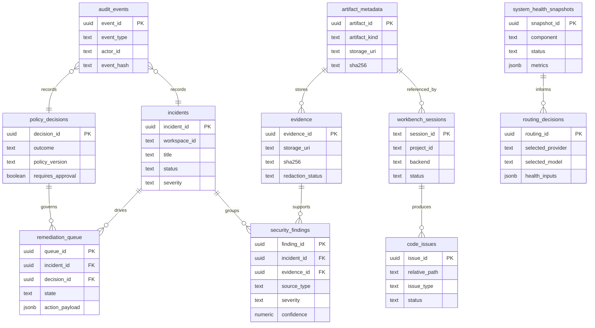
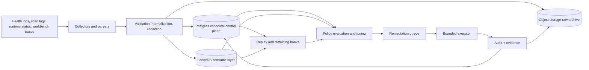

# Database Architecture for Bazzite Laptop

## Executive summary

The repo and Notion workspace already describe a system that is no longer “just a local RAG toy.” It is becoming a local AI control plane with four hard requirements: authoritative operational state, safety-gated automation, semantic retrieval, and durable evidence/audit history. The evidence is consistent across the repo and Notion: the system already persists state across LanceDB, SQLite, JSON, JSONL, S3-compatible archival patterns, and Notion phase control, while recent phases formalize Security Autopilot, Agent Workbench, scoped budgets, routing replay, provenance, and local identity. fileciteturn17file0L1-L1 fileciteturn18file0L1-L1 fileciteturn19file0L1-L1 fileciteturn20file0L1-L1 fileciteturn21file0L1-L1 fileciteturn22file0L1-L1 fileciteturn23file0L1-L1 fileciteturn32file0L1-L1 fileciteturn11file0L1-L1 fileciteturn13file0L1-L1

My recommendation remains architecture-consistent with your earlier conclusion, but it needs one operational adjustment because you want the system to stay 100% free right now: use **self-hosted PostgreSQL now as the canonical operational/control database**, keep **LanceDB as the semantic/vector intelligence layer**, and use **local or S3-compatible object storage for evidence/log archives**, with the schema kept **Supabase-compatible** so you can move to entity["company","Supabase","backend platform"] later without redesign. Under the current free-plan constraints documented by Supabase, a managed-first rollout is possible, but it is not the strongest no-cost posture because free projects are limited, storage/database quotas are small for log-heavy systems, and free projects can be paused. citeturn1search0turn1search1turn1search2turn10search0

That means the best end-state architecture for this repo is:

**canonical Postgres**
+ **LanceDB**
+ **object storage**
+ **Notion only as build-time/project-control truth until cutover**

The strongest **current** implementation, given your “solo operator, 100% free, local-first” constraint, is:

**self-hosted PostgreSQL**
+ **LanceDB**
+ **local filesystem or entity["company","MinIO","object storage company"]**
+ **optional later migration to Supabase-compatible hosting**
+ **optional later off-device archive to entity["company","Cloudflare","edge network company"] R2 if you remain within the free tier**. fileciteturn17file0L1-L1 fileciteturn23file0L1-L1 citeturn8search0turn8search2turn8search3

The decision rule is simple. Postgres should own **trusted operational truth**. LanceDB should own **retrieval and semantic intelligence**. Object storage should own **bulky evidence and archives**. Notion should continue to own **planning/build truth** until you intentionally replace that part. fileciteturn11file0L1-L1 fileciteturn12file0L1-L1 fileciteturn17file0L1-L1

## Ground truth from the repo and Notion

The codebase already proves that the current persistence model is fragmented enough that a canonical database is overdue. Repo docs and runtime path definitions show mutable state spread across `identity.db`, `task-queue.db`, `projects.json`, `sessions.json`, `test-commands.json`, `budgets.json`, `budget-audit.jsonl`, `autopilot-audit.jsonl`, LanceDB tables under `~/security/vector-db/`, ingest state JSON files, archive state JSON, storage reports, security status files, alerts, key/LLM status files, and S3-compatible log archive flows. This is workable in the short term, but it is the exact pattern that becomes hard to audit, enforce, and migrate safely once routing, policy, remediation, and code intelligence all depend on the same truth graph. fileciteturn17file0L1-L1 fileciteturn18file0L1-L1 fileciteturn19file0L1-L1 fileciteturn20file0L1-L1 fileciteturn21file0L1-L1 fileciteturn22file0L1-L1 fileciteturn23file0L1-L1 fileciteturn27file0L1-L1 fileciteturn42file0L1-L1

LanceDB is not a side experiment in this repo. It is already the standard vector/memory substrate. The agent rules explicitly say “No ChromaDB; LanceDB is the repo-standard vector/memory store,” and the current store implementation defines tables for `security_logs`, `threat_intel`, `docs`, `code_files`, and `workflow_runs`, with FTS indexes and a local vector-search cache. Internal repo memory also records LanceDB as the current vector layer for document ingestion, log ingestion, and code ingestion. fileciteturn17file0L1-L1 fileciteturn18file0L1-L1 fileciteturn28file0L1-L1

The repo also shows that some currently vector-backed data is not actually best treated as vector-native truth. The provenance graph now lives in LanceDB tables `provenance_nodes` and `provenance_edges`, but the feature is fundamentally about scoped lineage, causality, explanations, references, and auditability. That is relational/audit data first, semantic retrieval data second, which is why I recommend moving the canonical provenance graph to Postgres and keeping only semantic mirrors or explanation summaries in LanceDB. fileciteturn32file0L1-L1 fileciteturn35file0L1-L1

On the Notion side, the workspace very clearly positions Notion as the build-time control plane, not the final runtime database. The “Bazzite docs” hub states that the `Bazzite Phases` database remains the control plane and canonical home for phase planning and closeout artifacts, while the quality audit shows real hygiene and consistency issues across phase rows, including missing commit SHAs, missing validation summaries, missing lifecycle dates, duplicate rows, and page-body/property drift. That is precisely why Notion is still excellent for planning and governance, but should not become the long-term runtime database for incidents, logs, routing, or code intelligence. fileciteturn11file0L1-L1 fileciteturn12file0L1-L1

The current Notion phase state also reinforces the operational maturity of the system. The project review page describes the Security Autopilot foundation as completed, with policy-first execution, approval gates, and auditable operations as non-negotiable guarantees. The P126 acceptance row in Notion confirms that P119–P125 were validated together as an integrated Security Autopilot + Agent Workbench system, with explicit proof requirements around no unrestricted AI execution, no arbitrary shell remediation, policy gating, approval gating, and evidence completeness. That means the database architecture now needs to preserve those guarantees rather than undermine them through ad hoc storage sprawl. fileciteturn13file0L1-L1 fileciteturn40file0L1-L1

### Key internal sources reviewed

The report is grounded primarily in the following repo files and Notion pages:

| Internal source | Why it matters |
|---|---|
| `docs/AGENT.md` | Canonical repo operating rules, safety rules, runtime data paths, and storage standards |
| `docs/project_memory.md` | Captures the concrete LanceDB pipeline and current vector-table inventory |
| `docs/P119_P139_DATABASE_GROUNDED_ROADMAP.md` | Ties database needs to the current Security Autopilot + Workbench roadmap |
| `ai/rag/store.py` | Current LanceDB tables, FTS strategy, search cache, code/docs/log storage |
| `ai/provenance.py` | Current provenance graph implementation and why it should move canonically to Postgres |
| `ai/security_autopilot/models.py` and `ai/security_autopilot/audit.py` | Defines the operational security objects and append-only audit requirements |
| `ai/identity/models.py` | Current SQLite identity/trusted-device/step-up persistence |
| `ai/collab/task_queue.py` | Current SQLite task queue persistence |
| `ai/agent_workbench/paths.py`, `registry.py`, `sessions.py` | Current project/session registries and JSON persistence model |
| `ai/budget_scoped.py` and `docs/evidence/p130/validation.md` | Current budget model, audit log, and routing-budget semantics |
| `scripts/archive-logs-r2.py` | Existing S3-compatible archive pattern and archive/ingest state handling |
| Notion: `Bazzite docs`, `Bazzite Phases Database Quality Audit`, `Bazzite Project Review — Security Autopilot Transition`, `P126 — Full Autopilot Acceptance Gate` | Build-time control-plane truths, current safety constraints, and phase-state evidence |

Those sources are the backbone of the recommendations below. fileciteturn17file0L1-L1 fileciteturn18file0L1-L1 fileciteturn16file0L1-L1 fileciteturn28file0L1-L1 fileciteturn32file0L1-L1 fileciteturn33file0L1-L1 fileciteturn34file0L1-L1 fileciteturn19file0L1-L1 fileciteturn20file0L1-L1 fileciteturn37file0L1-L1 fileciteturn38file0L1-L1 fileciteturn21file0L1-L1 fileciteturn22file0L1-L1 fileciteturn36file0L1-L1 fileciteturn23file0L1-L1 fileciteturn11file0L1-L1 fileciteturn12file0L1-L1 fileciteturn13file0L1-L1 fileciteturn40file0L1-L1

## Platform options and the decision

At a high level, there are really three viable shapes for this project:

1. **Managed relational control plane + LanceDB + object storage**
2. **Self-hosted relational control plane + LanceDB + object storage**
3. **A one-store simplification attempt**
   
The first two can work. The third is where most future pain comes from.

### Relational control-plane options

entity["company","Supabase","backend platform"] is the strongest managed option because it gives you managed Postgres, built-in APIs, RLS-aware browser access, storage, and backup tooling on top of standard Postgres. Its docs position RLS as the core security primitive for browser-facing data access, and its database offering is still “full Postgres,” which is exactly why a Supabase-compatible schema is strategically useful even if you do not start there. The free-plan constraints matter, though: two active free projects, 500 MB database size per project, 1 GB storage quota, and the possibility of project pauses make it a good future convenience layer, but a weaker “hard free local control plane” than self-hosted Postgres for a log- and evidence-heavy solo system. citeturn10search3turn10search4turn1search0turn1search1turn1search2turn10search0

Self-hosted PostgreSQL is the strongest fit **today** because it removes quota and pause risk while staying fully aligned with the repo’s local-first design, localhost-oriented service model, and no-friction intelligence architecture. PostgreSQL gives you relational integrity, `jsonb`, indexing, RLS, and mature backup/PITR mechanisms. The tradeoff is operational burden: you now own backup execution, WAL archiving, retention checks, auth hardening, and restore drills. For a single-user system that already prefers local services and bounded tooling, that tradeoff is acceptable and, in this case, preferable. citeturn3search2turn3search4turn2search0turn2search2turn11search0

### Vector and retrieval options

The current repo is already optimized around LanceDB, and the repo’s own safety/architecture rules say to prefer LanceDB over ChromaDB. Official LanceDB docs describe it as an open-source embedded retrieval library / local database layer supporting vector search, full-text search, hybrid search, filtering, SQL, and versioned table abstractions. That is an unusually strong fit for this repo because the current retrieval workload is local, embedded, hybrid, multi-table, and tightly coupled to your Python app and system timers. fileciteturn17file0L1-L1 citeturn4search1turn4search3turn4search5turn4search6turn9search3

`pgvector` is the best “single-database simplification” alternative if you absolutely wanted to reduce moving parts. It is a mature Postgres extension for storing embeddings and performing similarity search, and it supports exact search plus HNSW and IVFFlat indexes. But in this repo, pgvector is better as an **adjunct option** than as a replacement for LanceDB, because replacing LanceDB would force you to migrate a repo-standard semantic layer that already has FTS, hybrid search, code/doc/log tables, repair tooling, and maintenance logic. In other words, pgvector is good technology; it is simply not the best fit for this repo’s current semantic center of gravity. citeturn10search5turn0search4

entity["company","Qdrant","vector database company"] is a credible alternative if you wanted a more server-like vector database with strong metadata payload filtering. The official client supports local in-memory and on-disk modes without a separate server, and Qdrant’s payload system is excellent for filtered semantic search. But that substitute would still duplicate a repo-standard LanceDB layer and would not solve the need for a canonical relational control plane. It is a respectable “if we ever abandon LanceDB” option, but not a better recommendation than “keep LanceDB.” citeturn9search0turn5search0turn5search1turn5search2

Milvus is powerful, but it is overbuilt for this machine and this phase of the project. Milvus Lite is explicitly positioned for notebooks, laptops, edge devices, and small-scale prototyping, and its own materials note limitations around users/roles/RBAC and related production features. That makes Milvus Lite fine for experiments, but not an advantage over the LanceDB layer you already have. Full Milvus, meanwhile, is more operationally expensive than the current repo warrants. citeturn4search2turn9search2turn6search6

entity["company","Weaviate","vector database company"] and entity["company","Chroma","ai database company"] are also weaker fits here. Weaviate has strong hybrid search and good cloud-native capabilities, but its official local quickstart uses Docker and recommends modern hardware with at least 8 GB of RAM and preferably 16 GB or more; on a 16 GB laptop that is already running your control plane, that is not a compelling reason to add another always-on service. Chroma is easy to start locally and supports persistent local storage, metadata filtering, dense/sparse/hybrid search, and local clients, but its own docs position `PersistentClient` as intended for local development and testing, and for production they steer users toward a server-backed instance. That is exactly why LanceDB remains the cleaner embedded choice for this repo. citeturn6search0turn6search1turn6search2 citeturn7search0turn7search1turn7search3turn7search5

### Comparative recommendation table

| Option | Fit for Bazzite repo | Free-first suitability | Ops burden | Semantic fit | Security/audit fit | Verdict |
|---|---|---:|---:|---:|---:|---|
| Self-hosted Postgres + LanceDB + local/MinIO object storage | Excellent | Excellent | Medium | Excellent | Excellent | **Best current choice** |
| Supabase + LanceDB + Storage | Excellent later | Good but quota/pause constrained | Low | Excellent | Excellent | **Best managed later choice** |
| Postgres + pgvector only | Good | Good | Medium | Moderate | Excellent | Good simplification, not best fit |
| Qdrant + Postgres | Good | Good | Medium | Good | Excellent | Reasonable fallback if LanceDB were dropped |
| Milvus Lite / Milvus + Postgres | Fair | Fair | Medium to High | Good | Good | Too heavy or too prototype-biased |
| Weaviate + Postgres | Fair | Fair | High | Good | Good | Unnecessary service weight |
| Chroma + Postgres | Fair | Good | Low to Medium | Fair | Fair | Fine for simpler apps, not this control plane |
| Keep current mixed stores | Poor | Good short-term | Low short-term / High long-term | Fair | Poor | Do not continue this path |

The key point is not that the alternatives are bad technologies. It is that this repo already has a semantic standard, a local-first safety model, and a growing need for trustworthy relational joins. That makes the winning answer much more architectural than brand-driven. fileciteturn17file0L1-L1 fileciteturn28file0L1-L1 citeturn1search0turn10search5turn9search0turn4search2turn6search0turn7search0turn4search6

## Target architecture, migration mapping, and schema

### Recommended architecture

For this repo, the target architecture should be:

- **Postgres** for authoritative operational truth
- **LanceDB** for embeddings, hybrid retrieval, semantic caching, and code/log/doc search
- **object storage** for raw evidence, raw logs, screenshots, archives, and export bundles
- **Notion** retained short-term as the build/phase control plane, then optionally mirrored or replaced later
- **Git-tracked config-as-code** kept in the repo for static rules, allowlists, and deployment config

That separation matches both the repo’s live behavior and your system goals: better RAG, better routing intelligence, better coding intelligence, and better security intelligence without letting all of those concerns collapse into one mutable flat-file sprawl. fileciteturn16file0L1-L1 fileciteturn17file0L1-L1 fileciteturn23file0L1-L1

### Storage artifact mapping

The table below maps the major current stores in the repo and Notion to their recommended target.

| Current artifact | Current form | Recommended target | Priority | Effort | Notes |
|---|---|---|---:|---:|---|
| `identity.db` | SQLite | Postgres adjunct tables `operators`, `trusted_devices`, `step_up_challenges` | High | S | Security-critical, small, easy migration |
| `task-queue.db` | SQLite | Postgres `remediation_queue` plus adjunct `task_queue` if you keep generic work orchestration | Medium | M | Separate remediation from generic collaboration tasks |
| `projects.json` | JSON | Postgres adjunct `projects` table | High | S | Needed for workbench scoping |
| `sessions.json` | JSON | Postgres `workbench_sessions` | High | S | Core workbench truth |
| `test-commands.json` | JSON | Postgres adjunct `test_command_profiles` or keep in Git if mostly static | Low | S | Only migrate if mutable per project |
| `budgets.json` | JSON | Postgres adjunct `budget_scopes` / `budget_assignments` | High | S | Needed for routing + token control |
| `budget-audit.jsonl` | JSONL | Postgres `audit_events` + raw object archive | High | S | Keep append-only semantics |
| `autopilot-audit.jsonl` | JSONL | Postgres `audit_events` + raw object archive | High | S | Critical for security history |
| `~/security/.status` | JSON-like status file | Postgres `system_health_snapshots` | Medium | S | Ingest and retain snapshots |
| `~/security/alerts.json` | JSON | Postgres `security_findings` / `incidents` | High | M | Normalize into finding/incident model |
| `~/security/llm-status.json` | JSON | Postgres `routing_decisions` + `system_health_snapshots` | Medium | S | Status + routing health dimensions |
| `~/security/key-status.json` | JSON | Postgres `system_health_snapshots` | Medium | S | Store presence/health only, never raw secrets |
| `.ingest-state.json`, `.doc-ingest-state.json`, `.code-ingest-state.json`, `.archive-state.json` | JSON | Postgres `artifact_metadata` | Medium | S | Operational metadata, not semantic truth |
| `storage-YYYY-MM-DD-HHMM.json` reports | JSON | Postgres `system_health_snapshots` + object archive | Medium | S | Useful for trend analysis |
| `pending_ingest.jsonl`, `processed_ingest.jsonl` | JSONL | Object storage raw + Postgres `artifact_metadata` + LanceDB semantic copy | Medium | M | Preserve raw evidence and semantic value |
| `quarantine-hashes-enriched.jsonl` | JSONL | Object storage raw + Postgres `artifact_metadata` + LanceDB threat collections | Medium | M | Security enrichment artifact |
| LanceDB `docs` | LanceDB | Stay in LanceDB | Low | None | Semantic retrieval data |
| LanceDB `security_logs` | LanceDB | Stay in LanceDB; mirror summary refs into Postgres | Medium | S | Keep semantic log search |
| LanceDB `threat_intel` | LanceDB | Stay in LanceDB | Low | None | Semantic threat retrieval |
| LanceDB `code_files` | LanceDB | Stay in LanceDB | Low | None | Best for code search |
| LanceDB `workflow_runs` | LanceDB | Canonical Postgres table later; keep semantic mirror in LanceDB | Medium | M | Good candidate for dual-write |
| LanceDB `provenance_nodes`, `provenance_edges` | LanceDB | Canonical Postgres graph-ish relational model + LanceDB explanation mirror | High | M | Important architecture correction |
| Notion `Bazzite Phases` database | Notion DB | Keep in Notion for now; optional later mirror to Postgres `phase_registry` | Low | M | Build-time truth, not runtime truth |
| Notion phase pages and ledgers | Notion pages | Keep until intentional PM migration; export artifacts to object storage as needed | Low | M | Do not block runtime database rollout on this |
| R2 archive pattern | S3-compatible remote object storage flow | Keep pattern; repoint first to local/MinIO or free R2 as optional off-device mirror | Medium | S | Existing code already uses S3 semantics |

This mapping is grounded in the repo’s actual current stores, not an abstract greenfield design. fileciteturn17file0L1-L1 fileciteturn18file0L1-L1 fileciteturn19file0L1-L1 fileciteturn20file0L1-L1 fileciteturn21file0L1-L1 fileciteturn22file0L1-L1 fileciteturn23file0L1-L1 fileciteturn27file0L1-L1 fileciteturn28file0L1-L1 fileciteturn32file0L1-L1 fileciteturn42file0L1-L1

### Proposed Postgres core schema

Below is the concrete core schema I recommend for the tables you specifically asked for. For a clean implementation, I also recommend adjunct tables for `operators`, `projects`, `budget_scopes`, `trusted_devices`, and `step_up_challenges`, but the following are the runtime core.

| Table | Core columns | Indexes | RLS considerations |
|---|---|---|---|
| `security_findings` | `finding_id uuid pk`, `workspace_id text`, `project_id text`, `incident_id uuid null`, `source_type text`, `source_ref text`, `title text`, `description text`, `severity text`, `category text`, `confidence numeric(5,4)`, `status text`, `dedupe_hash text`, `evidence_id uuid null`, `metadata jsonb`, `detected_at timestamptz`, `first_seen_at timestamptz`, `last_seen_at timestamptz`, `created_at timestamptz`, `updated_at timestamptz` | unique(`dedupe_hash`), btree(`workspace_id`,`last_seen_at desc`), btree(`severity`,`status`), gin(`metadata`) | Policy by `workspace_id`; future actor scoping for multi-user |
| `incidents` | `incident_id uuid pk`, `workspace_id text`, `project_id text`, `title text`, `summary text`, `severity text`, `status text`, `opened_at timestamptz`, `triaged_at timestamptz`, `closed_at timestamptz`, `primary_finding_id uuid null`, `owner_actor_id text null`, `tags text[]`, `metadata jsonb` | btree(`workspace_id`,`status`,`severity`), partial index on open incidents, gin(`tags`), gin(`metadata`) | Same workspace scoping; owner-based update policies later |
| `evidence` | `evidence_id uuid pk`, `workspace_id text`, `project_id text`, `kind text`, `storage_uri text`, `sha256 text`, `content_type text`, `size_bytes bigint`, `redaction_status text`, `source_tool text`, `captured_at timestamptz`, `expires_at timestamptz null`, `metadata jsonb` | unique(`sha256`), btree(`workspace_id`,`captured_at desc`), btree(`kind`), gin(`metadata`) | Read restrictions stricter than findings; optionally separate admin-only policy |
| `policy_decisions` | `decision_id uuid pk`, `workspace_id text`, `incident_id uuid null`, `finding_id uuid null`, `decision_type text`, `outcome text`, `policy_version text`, `rationale text`, `approver_actor_id text null`, `requires_approval boolean`, `approved_at timestamptz null`, `input_hash text`, `metadata jsonb`, `created_at timestamptz` | btree(`workspace_id`,`created_at desc`), btree(`outcome`,`requires_approval`), unique(`input_hash`,`policy_version`) | Strict backend-only writes; UI can read via RLS |
| `remediation_queue` | `queue_id uuid pk`, `workspace_id text`, `incident_id uuid`, `finding_id uuid null`, `decision_id uuid null`, `action_type text`, `action_payload jsonb`, `priority int`, `state text`, `scheduled_for timestamptz null`, `started_at timestamptz null`, `finished_at timestamptz null`, `rollback_metadata jsonb`, `executor_run_id text null`, `created_at timestamptz`, `updated_at timestamptz` | btree(`workspace_id`,`state`,`priority`), partial index on pending rows, gin(`action_payload`) | Only privileged service/backend role inserts or mutates |
| `audit_events` | `event_id uuid pk`, `workspace_id text`, `project_id text`, `session_id text null`, `incident_id uuid null`, `finding_id uuid null`, `decision_id uuid null`, `event_type text`, `actor_id text`, `source_tool text`, `summary text`, `payload jsonb`, `prev_hash text`, `event_hash text`, `created_at timestamptz` | btree(`workspace_id`,`created_at desc`), btree(`event_type`,`created_at desc`), unique(`event_hash`), gin(`payload`) | Append-only writes; optionally use trigger to block updates/deletes |
| `system_health_snapshots` | `snapshot_id uuid pk`, `workspace_id text`, `component text`, `component_instance text null`, `status text`, `severity text`, `metrics jsonb`, `checks jsonb`, `source_artifact_id uuid null`, `captured_at timestamptz`, `created_at timestamptz` | btree(`workspace_id`,`component`,`captured_at desc`), partial index on unhealthy states, gin(`metrics`), gin(`checks`) | Readable to operator; write only by ingest jobs |
| `routing_decisions` | `routing_id uuid pk`, `workspace_id text`, `session_id text null`, `task_type text`, `requested_model text null`, `selected_provider text`, `selected_model text`, `decision_reason text`, `latency_ms int null`, `cost_estimate_usd numeric(12,6) null`, `budget_id text null`, `health_inputs jsonb`, `rejected_candidates jsonb`, `replay_fixture_id text null`, `created_at timestamptz` | btree(`workspace_id`,`created_at desc`), btree(`task_type`,`selected_provider`), gin(`health_inputs`), gin(`rejected_candidates`) | Readable to operator; backend-only writes |
| `code_issues` | `issue_id uuid pk`, `workspace_id text`, `project_id text`, `session_id text null`, `relative_path text`, `symbol_name text null`, `line_start int null`, `line_end int null`, `issue_type text`, `severity text`, `title text`, `description text`, `status text`, `canonical_snippet_hash text null`, `fix_summary text null`, `metadata jsonb`, `created_at timestamptz`, `resolved_at timestamptz null` | btree(`workspace_id`,`project_id`,`created_at desc`), btree(`relative_path`,`status`), unique(`canonical_snippet_hash`) where not null, gin(`metadata`) | Scoped by workspace/project; future collaborator scoping possible |
| `artifact_metadata` | `artifact_id uuid pk`, `workspace_id text`, `project_id text null`, `artifact_kind text`, `logical_name text`, `source_path text null`, `storage_uri text null`, `sha256 text`, `content_type text`, `size_bytes bigint`, `retention_class text`, `supersedes_artifact_id uuid null`, `metadata jsonb`, `created_at timestamptz` | unique(`sha256`,`artifact_kind`), btree(`workspace_id`,`artifact_kind`,`created_at desc`), gin(`metadata`) | Read policy by workspace; delete restricted |
| `workbench_sessions` | `session_id text pk`, `workspace_id text`, `project_id text`, `backend text`, `cwd text`, `status text`, `sandbox_profile text`, `lease_expires_at timestamptz null`, `git_branch text null`, `git_head_sha text null`, `handoff_summary text null`, `test_summary jsonb`, `artifact_refs uuid[]`, `created_at timestamptz`, `updated_at timestamptz` | btree(`workspace_id`,`project_id`,`updated_at desc`), btree(`status`,`lease_expires_at`), gin(`test_summary`) | Scoped by workspace/project; only owner/service can mutate |

### Recommended adjunct tables

These are not optional forever if you want a clean system, but they can ship just after the core:

- `operators`
- `projects`
- `budget_scopes`
- `trusted_devices`
- `step_up_challenges`
- `phase_registry` and `phase_artifacts` if/when you migrate build truth off Notion
- `retention_policies`
- `ingest_runs`
- `embedding_jobs`

### Example DDL style

```sql
create table security_findings (
  finding_id uuid primary key,
  workspace_id text not null,
  project_id text,
  incident_id uuid references incidents(incident_id),
  source_type text not null,
  source_ref text,
  title text not null,
  description text not null,
  severity text not null check (severity in ('info','low','medium','high','critical')),
  category text not null,
  confidence numeric(5,4) not null check (confidence >= 0 and confidence <= 1),
  status text not null default 'open',
  dedupe_hash text not null,
  evidence_id uuid references evidence(evidence_id),
  metadata jsonb not null default '{}'::jsonb,
  detected_at timestamptz not null,
  first_seen_at timestamptz not null,
  last_seen_at timestamptz not null,
  created_at timestamptz not null default now(),
  updated_at timestamptz not null default now(),
  unique (dedupe_hash)
);

create index idx_findings_ws_time on security_findings (workspace_id, last_seen_at desc);
create index idx_findings_severity_status on security_findings (severity, status);
create index idx_findings_metadata on security_findings using gin (metadata);
alter table security_findings enable row level security;
```

The schema choice is a fairly direct translation of the repo’s current operational objects and safety model. You already have explicit models for findings, incidents, evidence bundles, audit events, remediation plans, budgets, identity state, workbench sessions, and provenance chains. The main architectural shift is not inventing new domains; it is putting the right domains into the right store. fileciteturn19file0L1-L1 fileciteturn21file0L1-L1 fileciteturn22file0L1-L1 fileciteturn32file0L1-L1 fileciteturn33file0L1-L1 fileciteturn34file0L1-L1

### ER diagram



## LanceDB role, ingestion design, and token reduction

### How LanceDB should be used

LanceDB should remain the semantic intelligence layer for four concrete workloads.

First, it should continue to store **document embeddings and hybrid-searchable docs**. The current store already maintains `docs` with vector search plus FTS, and this is exactly where your phase docs, runbooks, system docs, canonical snippet summaries, and exported policy explanations belong semantically. fileciteturn28file0L1-L1 citeturn4search1turn4search3turn4search5turn4search6

Second, it should continue to store **code search embeddings**. The current `code_files` table shape already supports symbol-level metadata, line spans, paths, and content. That makes LanceDB the obvious place for code RAG, semantic code reuse, “show me related fixes,” canonical snippet recall, and low-token retrieval of prior code/issue context. Postgres should store the authoritative issue/workbench history; LanceDB should store the retrieval projection of that history. fileciteturn28file0L1-L1

Third, it should continue to store **security log and threat-intel embeddings**. The repo already uses LanceDB for `security_logs`, `threat_intel`, and related ingestion workflows. That should continue, but with normalized summary rows and foreign-key-like metadata in Postgres so you can reliably answer both “what semantically resembles this?” and “what did the system actually decide and do?” without forcing those questions into one store. fileciteturn18file0L1-L1 fileciteturn28file0L1-L1 fileciteturn43file0L1-L1

Fourth, LanceDB should own **semantic caching and explanation retrieval**. Your current store already keeps an in-memory vector-hash cache, and the repo’s agent guidance is heavily optimized for token efficiency and targeted reads. Extend that pattern by storing retrieval-ready “explanation units” in LanceDB: canonical incident summaries, normalized code issue summaries, routing replay explanations, workbench handoff summaries, and remediation rationale digests. That is how you reduce token use without losing context. fileciteturn17file0L1-L1 fileciteturn28file0L1-L1 fileciteturn30file0L1-L1

### Closed-loop ingestion pipeline for security and health

The ingestion architecture should be a bounded closed loop, not an unconstrained self-modifying loop. That distinction matters because the repo’s existing safety rules prohibit arbitrary shell execution, destructive remediation without policy and approval, and using AI as the trust anchor. So the database should enable **automatic tuning and automatic low-risk enforcement**, while keeping dangerous changes gated. fileciteturn13file0L1-L1 fileciteturn17file0L1-L1 fileciteturn40file0L1-L1

The recommended data flow is:



Operationally, each ingest run should do the following:

- collect raw source files or events
- calculate content hashes and source fingerprints
- redact secrets, tokens, email, and sensitive paths
- write the **raw artifact** to object storage
- write the **normalized operational record** to Postgres
- write the **retrieval projection** to LanceDB
- evaluate policy against normalized records
- emit decisions and queue items
- execute only bounded, allowlisted, policy-allowed actions
- record post-action results in Postgres and object storage
- produce replay fixtures and tuning suggestions from outcomes

That design lets “real system data” tune the system without giving raw logs or model suggestions direct authority over destructive behavior. Low-risk automatic adjustments can safely include threshold tuning, noise suppression, dedupe windows, risk weighting, routing heuristics, retry backoff, source weighting, and cache invalidation policies. High-risk adjustments — widening allowlists, enabling new remediation classes, changing secret-handling policy, changing shell or service mutation permissions, or promoting a remediation from approval-gated to auto-allowed — should require approval and a canary period. fileciteturn33file0L1-L1 fileciteturn34file0L1-L1 fileciteturn36file0L1-L1 fileciteturn40file0L1-L1

### Object storage design

Object storage should hold the data that is large, immutable-ish, archival, or expensive to keep in Postgres. That includes compressed raw logs, raw evidence bundles, screenshots, browser/runtime output, workbench artifacts, exports, replay fixtures, and any “proof object” that needs a durable content hash. The archive script already compresses files, uploads them through `boto3` to an S3-compatible endpoint, records archive state, and only deletes a local file after ingest verification. That logic is already the correct shape; it just needs to point to the right storage backend and to write stronger metadata into Postgres. fileciteturn23file0L1-L1

For a 100% free rollout, the safest sequence is:

- **local filesystem first**, on your known storage paths
- **optional local S3-compatible MinIO second** if you want uniform bucket semantics
- **optional R2 mirror later** only if you remain comfortably within the free tier

R2’s free tier is helpful, but it is still a quotaed external service, not a true “zero-constraints local storage” substitute. The current free allowance is 10 GB-month of storage, 1 million Class A ops, and 10 million Class B ops per month. That may be enough for early archive/off-device backup use, but it is not the right thing to make mandatory for the first free implementation. citeturn8search0turn8search2turn8search3

### Token-reduction strategy

A large part of your database value is not storage volume; it is **context compression quality**. The database should reduce token usage in at least six ways.

First, store and retrieve **code diffs instead of whole files** for most coding sessions. Workbench history should persist diff summaries, affected symbols, test summaries, and artifact refs in Postgres, while the semantic form of those changes lives in LanceDB. Repo provenance and workbench features already point in this direction. fileciteturn21file0L1-L1 fileciteturn32file0L1-L1

Second, create **canonical snippet records** keyed by content hash, language, symbol, issue type, and fix outcome. When the same or similar issue reappears, retrieve the canonical snippet summary rather than replaying the full historical conversation. That should map to `code_issues` in Postgres and `code_files` plus a new `canonical_snippets` LanceDB collection. This is an inference from the current code-index and workbench model, but it fits the repo’s existing token-efficient session rules. fileciteturn17file0L1-L1 fileciteturn28file0L1-L1

Third, chunk by **semantic unit**, not only by fixed length. The current code schema already stores symbol names and line spans, and the docs/log ingestion model is already structured. Preserve that. For code, chunk by symbol or logical diff hunk. For logs, chunk by event block or bounded time window. For docs, chunk by heading section. Then attach dense metadata in Postgres and semantic projection in LanceDB. fileciteturn28file0L1-L1

Fourth, maintain **summaries at multiple levels**: raw artifact, normalized event, session summary, project summary, and canonical historical pattern. The runtime should fetch the smallest adequate layer first. That hierarchy is essential for low-token routing and coding assistance.

Fifth, use **semantic cache keys** derived from normalized task type, project, code hash/diff hash, file set, and user intent. The current repo already uses vector-hash caching at the search level; extend that to whole retrieval bundles and summarized responses. fileciteturn28file0L1-L1

Sixth, keep **retrieval ordering strict**: exact match and metadata filters first, canonical snippets second, recent workbench/project history third, semantic neighbors fourth, full historical search only when needed. That ordering is usually what cuts token waste the most.

## Security, privacy, operations, and rollout

### Security and privacy controls

The database architecture should directly reinforce the repo’s existing safety posture. The repo explicitly requires policy-first execution, approval gates, redacted evidence, append-only or tamper-evident audit events, no arbitrary shell from model output, no raw secret exposure, localhost-only bindings for critical services, and bounded tool/output behavior. Your database should make those guarantees easier to prove, not harder. fileciteturn13file0L1-L1 fileciteturn17file0L1-L1 fileciteturn40file0L1-L1

The control set I recommend is:

- **encryption in transit** for any non-local Postgres or object storage connection; for self-hosted local-only services, keep bindings local and use TLS if traffic ever leaves localhost
- **encryption at rest** through the host’s encrypted storage plus encrypted off-device/object backups where applicable
- **SCRAM or stronger auth** for Postgres, with `pg_hba.conf` locked down to localhost or explicitly trusted networks only
- **RLS enabled from day one** on all runtime tables if a browser/UI/API will read them
- **backend-only write roles** for `audit_events`, `policy_decisions`, and `remediation_queue`
- **append-only trigger model** for audit rows
- **content-hash addressing** for evidence objects
- **redaction before persistence**, never after
- **secrets rotation** and no service-role exposure in the browser
- **least privilege** for object-storage and database service accounts
- **retention classes** so raw logs, summaries, and semantic projections can expire differently
- **PII-aware ingestion** with email/token/path redaction before the write path
- **manual approval requirement** for high-risk policy changes and destructive actions

PostgreSQL’s docs describe current row-security policies, `pg_hba.conf` authentication controls, and the backup/PITR mechanisms you need for a trustworthy self-hosted deployment; Supabase’s docs add browser-safe RLS guidance, service-role cautions, storage policies, and managed backup behavior if you move there later. citeturn3search2turn11search0turn2search0turn2search2 citeturn10search3turn10search6turn10search7turn10search0

### Managed versus self-hosted tradeoff

| Dimension | Self-hosted Postgres now | Supabase later |
|---|---|---|
| Zero-cost local control | Best | Good, but quota/pause constrained |
| Operational simplicity | Worse | Better |
| Backup ownership | Yours | Managed daily backups plus your own exports recommended |
| Browser/API ergonomics | Manual | Excellent |
| RLS usability | Excellent but manual | Excellent and better integrated |
| Storage integration | Manual or MinIO/R2 | Native Storage product |
| Failure mode | You own outages | Vendor/platform dependence |
| Best fit for “100% free solo system” | **Yes** | **Not first choice** |
| Best fit for later convenience and external access | Good | **Yes** |

For self-hosted PostgreSQL, the minimum serious ops posture is nightly `pg_basebackup`, WAL archiving sufficient for PITR, routine restore drills, and off-device backup copies. PostgreSQL’s docs are explicit that PITR depends on continuous archived WAL plus a base backup, and that `pg_basebackup` is the standard way to create base backups of a running cluster. For Supabase, the platform provides daily backups even on the free plan, but the docs still recommend regular exports for free-tier users, and deleted/expired projects are not a good place to discover you relied too heavily on platform retention. citeturn2search0turn2search2turn10search0turn1search6

### Migration and phased rollout

The rollout should be staged so that you improve coherence without destabilizing the current system.

| Phase | Goal | Main actions | Rollback strategy | Validation |
|---|---|---|---|---|
| **Phase 1** | Stand up canonical Postgres | Create schema, adjunct tables, migration scripts, local backup routine | Stop writers, discard empty DB, continue current stores | Schema migration tests, CRUD smoke tests, backup test |
| **Phase 2** | Migrate small high-value stores | Move identity, workbench registries, budgets, audit logs metadata | Re-enable JSON/SQLite readers if needed | Diff counts, hash checks, dual-read comparison |
| **Phase 3** | Dual-write security and routing flows | Write findings/incidents/decisions/queue/audit/routing to Postgres while keeping current logs/LanceDB | Toggle app back to current write path | End-to-end integrated acceptance on autopilot and workbench |
| **Phase 4** | Correct provenance and archives | Move canonical provenance to Postgres; object-store evidence; keep semantic mirrors in LanceDB | Keep LanceDB provenance as fallback until parity proven | Explain/timeline parity tests, artifact hash verification |
| **Phase 5** | Optimize and optionally mirror PM truth | Retention jobs, replay hooks, semantic cache improvements, optional phase-registry mirror from Notion | Disable mirror jobs without touching runtime core | Replay reproducibility, token-usage comparison, restore drill |

The most important thing operationally is **dual-write before cutover** for the high-risk domains. Do not “big bang” migrate findings, incidents, audit events, and workbench sessions all at once. The repo’s acceptance culture already expects integrated validation and truthful degraded states; apply that same discipline to the database rollout. fileciteturn17file0L1-L1 fileciteturn40file0L1-L1

### FigJam plan and export checklist

Notion already records two earlier FigJam artifacts tied to the Security Autopilot and Agent Workbench acceptance flow, with diagram IDs `e2985d3b-12b4-410c-b014-b70e7ca4a611` and `38b02563-287d-47f3-b3bf-2b6cc9267f30`. Those are useful prior artifacts, but this database work should add a new system-level FigJam focused on storage boundaries, ingest loops, and migration sequencing. fileciteturn16file0L1-L1 fileciteturn40file0L1-L1

The FigJam board should use these frames:

- **Current-state storage map**  
  Show Notion, SQLite, JSON/JSONL, LanceDB, R2/archive, and where each is used today.
- **Target-state architecture**  
  Postgres / LanceDB / object storage / Notion build-control split.
- **Security closed loop**  
  Logs → normalize → decide → queue → execute → audit → replay/tune.
- **Schema cluster map**  
  Findings / incidents / evidence / policy / remediation / audit / workbench / routing.
- **Migration swimlane**  
  Phase 1 through Phase 5.
- **Retention classes**  
  Raw evidence, normalized metadata, semantic summaries, hot vs cold storage.
- **Token-efficiency loop**  
  code diff → summary → canonical snippet → vector index → low-token reuse.

A clean export checklist is:

- board title and date
- legend for store types and trust levels
- color coding for canonical vs semantic vs archive stores
- explicit “approval-gated” labels on risky loops
- explicit “single-user now / multi-user later” note
- diagram IDs recorded in Notion
- PNG export for quick review
- PDF export for closeout artifacts
- source `.fig` or FigJam retained for editing
- linked to the repo doc that will become the database architecture spec

### Final recommendation and next actions

The final recommendation is straightforward.

If the requirement is **best architecture for this repo in the abstract**, the answer is:

**Supabase-compatible Postgres as the canonical control plane + LanceDB as the semantic layer + object storage for evidence and log archives**.

If the requirement is **best architecture for this repo right now under a strict 100% free, solo, local-first constraint**, the answer is:

**self-hosted PostgreSQL now + LanceDB kept as-is + local filesystem or MinIO object storage now + optional Supabase/R2 later**.

That is not a contradiction. It is the same architecture, implemented in the free-first order that best matches your real constraints. citeturn1search0turn1search2turn8search0turn8search2

The next actionable steps I recommend are:

- create the Postgres schema and migrations for the 11 core tables plus `operators`, `projects`, `budget_scopes`, `trusted_devices`, and `step_up_challenges`
- implement dual-write for `workbench_sessions`, `audit_events`, `policy_decisions`, and `system_health_snapshots`
- move `identity.db`, `projects.json`, `sessions.json`, and `budgets.json` first
- keep LanceDB for docs, code, logs, threat intel, and semantic cache
- move canonical provenance out of LanceDB and into Postgres
- keep raw logs/evidence in object storage with hash-addressed metadata rows in Postgres
- add replay fixtures for security/routing/workbench outcomes so closed-loop tuning is evidence-backed and reproducible
- only after the runtime database is stable, decide whether to mirror or replace parts of the Notion build-control plane

### Final draft checklist

- [ ] Confirm local-first deployment choice: self-hosted Postgres now or Supabase now
- [ ] Approve the core schema and adjunct-table list
- [ ] Approve provenance move from LanceDB to Postgres canonical
- [ ] Approve object-storage backend for phase one: local filesystem vs MinIO
- [ ] Define retention classes for raw logs, evidence, semantic mirrors, and snapshots
- [ ] Define which policy changes may auto-tune and which always require approval
- [ ] Implement migration scripts for SQLite and JSON stores
- [ ] Add dual-write validation tests
- [ ] Add backup + restore drill for Postgres
- [ ] Add FigJam board with the frames listed above
- [ ] Record the new diagram artifact in Notion and the repo
- [ ] Convert this report into the final database architecture spec when you are ready to build