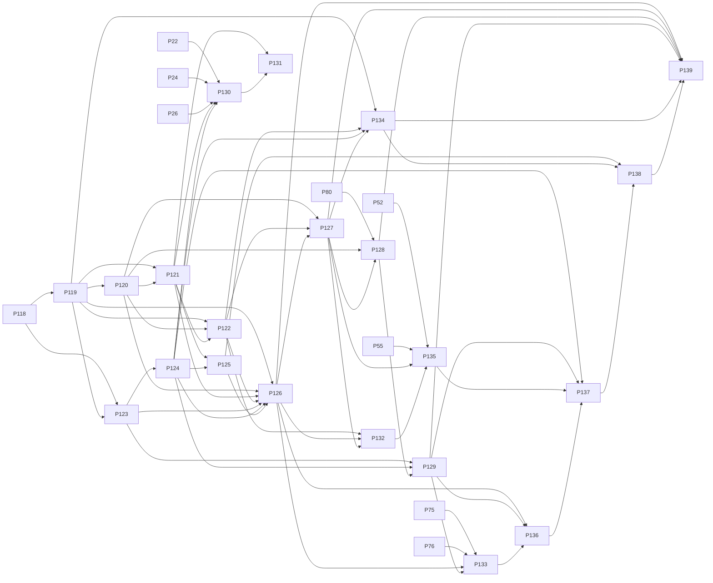

# P119–P139 Security Autopilot + Agent Workbench Roadmap

**Project:** `violentwave/bazzite-laptop`  
**Primary phase source of truth:** Notion `Bazzite Phases` database  
**Repo source of truth:** `HANDOFF.md`, `docs/AGENT.md`, phase docs, `PHASE_INDEX.md`, `PHASE_ARTIFACT_REGISTER.md`  
**Updated:** 2026-04-16  
**Supersedes:** older P119–P139 “observability / RBAC / routing-first” roadmap

---

## Executive Summary

The P119–P139 roadmap has been revised from the older observability/RBAC/routing-first roadmap into a focused productization path for:

1. **Security Autopilot** — a repo-native, policy-gated, audit-backed security automation layer.
2. **Agent Workbench** — a controlled project-folder workbench for OpenCode, Codex, Claude Code, Gemini CLI, and related coding agents.
3. **Governed AI control plane** — MCP policy, local identity, workspace isolation, quotas, replay labs, runbooks, provenance, privacy, packaging, canaries, and final GA reconciliation.

The guiding security principle is:

> The AI is never the trust anchor. Sensors and deterministic tools detect issues; policy decides allowed/blocked/approval-required; fixed allowlisted tools execute only when permitted; evidence and audit records prove what happened.

The guiding project-management principle is:

> Notion is the primary phase ledger. `HANDOFF.md` is only a lightweight session pointer to reduce token usage. Agents must query Notion for current phase truth, then update both Notion and repo docs after verified completion.

---

## Current State

| Phase | Current state | Notes |
|---|---|---|
| P118 | Done | Final System Acceptance completed before this revised roadmap. |
| P119 | Done | Security Autopilot Core implemented and committed as `d502c21`. |
| P120 | Planned / next critical phase | Security Policy Engine. Requires manual-approval discipline because it defines automation safety semantics. |
| P121–P139 | Planned | Follow the revised roadmap below. |

### P119 Completion Summary

P119 delivered a plan-only Security Autopilot core:

- `ai/security_autopilot/` package added.
- Models, sensor adapters, classifier, planner, evidence handling, and audit chain added.
- Remediation plans are generated only.
- Destructive actions are rejected.
- Evidence redaction and append-only/hash-chained audit logging added.
- Tests added in `tests/test_security_autopilot.py`.

Validation reported:

```text
.venv/bin/python -m pytest tests/test_security_autopilot.py -q -> 6 passed
ruff check ai/security_autopilot tests/test_security_autopilot.py -> passed
.venv/bin/python -m pytest tests/ -q --tb=short -> 2406 passed, 183 skipped
```

Commit:

```text
d502c21 feat(p119): add security autopilot core
```

---

## Roadmap Waves

| Wave | Phases | Goal |
|---|---|---|
| Wave 1 | P119–P122 | Build Security Autopilot core, policy engine, UI, and safe remediation runner. |
| Wave 2 | P123–P126 | Build Agent Workbench and validate the Autopilot + Workbench runtime in the browser. |
| Wave 3 | P127–P129 | Extend policy, local identity, step-up security, and workspace/actor isolation. |
| Wave 4 | P130–P133 | Add budget controls, routing replay, human runbooks, and provenance graph. |
| Wave 5 | P134–P139 | Add self-healing, integration governance, privacy, packaging, canaries, and GA reconciliation. |

---

## Priority Table

| Phase | Title | Status | Backend | Execution Mode | Risk | Dependencies |
|---:|---|---|---|---|---|---|
| P119 | Security Autopilot Core | Done | opencode | bounded | high | P118 |
| P120 | Security Policy Engine | Planned | opencode | manual-approval | critical | P119 |
| P121 | Security Autopilot UI | Planned | opencode | bounded | high | P119, P120 |
| P122 | Safe Remediation Runner | Planned | opencode | manual-approval | critical | P119, P120, P121 |
| P123 | Agent Workbench Core | Planned | opencode | bounded | high | P118, P119 |
| P124 | Codex/OpenCode UI Integration | Planned | opencode | bounded | high | P123 |
| P125 | Browser Runtime Acceptance | Planned | Full System Validation | bounded | critical | P121, P124 |
| P126 | Full Autopilot Acceptance Gate | Planned | Full System Validation | manual-approval | critical | P119, P120, P121, P122, P123, P124, P125 |
| P127 | MCP Policy-as-Code and Approval Gates | Planned | opencode | manual-approval | critical | P120, P122, P126 |
| P128 | Local Identity, Trusted Devices, and Step-up Security | Planned | opencode | manual-approval | critical | P80, P120, P127 |
| P129 | Workspace and Actor Context Isolation | Planned | opencode | bounded | high | P123, P124, P128 |
| P130 | Cost Quotas and Budget Automation | Planned | opencode | bounded | medium | P22, P24, P26, P121, P124 |
| P131 | Routing Evaluation and Replay Lab | Planned | opencode | bounded | medium | P121, P130 |
| P132 | Human-in-the-loop Orchestration Runbooks | Planned | opencode | manual-approval | high | P122, P126, P127 |
| P133 | Memory, Artifact, and Provenance Graph | Planned | opencode | bounded | medium | P75, P76, P126, P129 |
| P134 | Self-healing Control Plane | Planned | opencode | manual-approval | high | P119, P122, P124, P127 |
| P135 | Integration Governance for Notion, Slack, and GitHub Actions | Planned | opencode | bounded | medium | P52, P55, P127, P132 |
| P136 | Retention, Privacy, and Export Controls | Planned | opencode | bounded | medium | P126, P129, P133 |
| P137 | Deployment Profiles and Environment Packaging | Planned | opencode | bounded | medium | P124, P129, P135, P136 |
| P138 | Browser/Service Canary Release Automation | Planned | Full System Validation | bounded | high | P125, P134, P137 |
| P139 | GA Acceptance Gate and Phase-ledger Reconciliation | Planned | Full System Validation | manual-approval | critical | P126, P127, P128, P129, P134, P138 |

---

## Phase Details

### P119 — Security Autopilot Core

**Status:** Done  
**Commit:** `d502c21`  
**Objective:** Create the repo-native Security Autopilot core using existing Bazzite MCP security/system/log/agent tools. Normalize findings, incidents, policy decisions, remediation plans, audit events, and redacted evidence bundles without enabling destructive autonomous remediation.

**Delivered:**

- `ai/security_autopilot/models.py`
- `ai/security_autopilot/sensors.py`
- `ai/security_autopilot/classifier.py`
- `ai/security_autopilot/planner.py`
- `ai/security_autopilot/audit.py`
- `ai/security_autopilot/__init__.py`
- `tests/test_security_autopilot.py`
- `docs/P119_PLAN.md`

**Security guarantees:**

- plan-only remediation
- destructive actions rejected
- no arbitrary shell
- no sudo automation
- no raw secret exposure
- no Wazuh/default external SIEM dependency

---

### P120 — Security Policy Engine

**Objective:** Implement the Security Autopilot policy engine and configuration model that determines which actions are auto-allowed, approval-required, or blocked.

**Scope:**

- Add `ai/security_autopilot/policy.py`.
- Add `configs/security-autopilot-policy.yaml`.
- Add `tests/test_security_autopilot_policy.py`.
- Support modes:
  - `monitor_only`
  - `recommend_only`
  - `safe_auto`
  - `approval_required`
  - `lockdown`
- Support decision outcomes:
  - `auto_allowed`
  - `approval_required`
  - `blocked`
- Reject dangerous categories by default:
  - arbitrary shell
  - sudo
  - raw secret read
  - system writes
  - destructive remediation
- Require approval for:
  - quarantine
  - terminate process
  - disable service
  - rotate secret
  - firewall change
  - delete file

**Definition of Done:**

- Policy config exists.
- Policy evaluator maps actions to allow/approval/block decisions.
- Malformed input is rejected safely.
- Sensitive content is redacted in policy outputs.
- P119 remediation actions can be evaluated without execution.
- Tests cover allow/deny/approval/malformed/redaction paths.
- P120 Notion page body is corrected from stale RBAC text to Security Policy Engine text.

**Validation:**

```bash
.venv/bin/python -m pytest tests/test_security_autopilot_policy.py -q
ruff check ai/security_autopilot tests/test_security_autopilot_policy.py
.venv/bin/python -m pytest tests/ -q --tb=short
```

---

### P121 — Security Autopilot UI

**Objective:** Add Security Autopilot UI surfaces to the Unified Control Console.

**Scope:**

- Extend Security Ops UI; do not create a separate dashboard.
- Add views/tabs:
  - Autopilot overview
  - Findings
  - Incidents
  - Evidence
  - Audit Timeline
  - Policy
  - Remediation Queue
- Wire to real backend/MCP responses.
- Show truthful degraded states.
- Avoid fake actions and “Coming Soon” placeholders.
- Do not expose raw secrets.

**Likely affected files:**

```text
ui/src/components/security/*
ui/src/components/security-autopilot/*
ui/src/hooks/useSecurityAutopilot.ts
ui/src/types/security-autopilot.ts
ai/mcp_bridge/tools.py
configs/mcp-bridge-allowlist.yaml
tests/test_security_autopilot_tools.py
```

**Validation:**

```bash
cd ui && npx tsc --noEmit
cd ui && npm run build
.venv/bin/python -m pytest tests/test_security_autopilot_tools.py -q
ruff check ai/ tests/
```

---

### P122 — Safe Remediation Runner

**Objective:** Implement a controlled remediation runner that executes only fixed, allowlisted, policy-approved remediation actions with audit records and rollback metadata where possible.

**Scope:**

- Add `ai/security_autopilot/executor.py`.
- Connect executor to P120 policy.
- Use fixed actions only.
- Reject arbitrary/model-generated commands.
- Require approval for destructive actions.
- Record attempted action, policy result, evidence, audit event, and rollback metadata where possible.

**Hard constraints:**

- No arbitrary shell.
- No sudo automation.
- No model-generated command execution.
- No destructive execution without policy + approval.
- No raw secrets in logs/evidence/audit.

**Validation:**

```bash
.venv/bin/python -m pytest tests/test_security_autopilot_executor.py -q
ruff check ai/security_autopilot tests/test_security_autopilot_executor.py
.venv/bin/python -m pytest tests/ -q --tb=short
```

---

### P123 — Agent Workbench Core

**Objective:** Create the Agent Workbench backend so the operator can register/open any local project folder and manage agent sessions for OpenCode, Codex, Claude Code, Gemini CLI, and related agents through controlled project contexts.

**Scope:**

- Add `ai/agent_workbench/`.
- Implement:
  - project registry
  - session manager
  - sandbox profiles
  - git status helpers
  - test runner hooks
  - handoff helpers
- Register MCP tools:
  - `workbench.projects`
  - `workbench.register_project`
  - `workbench.open_project`
  - `workbench.create_session`
  - `workbench.list_sessions`
  - `workbench.attach_session`
  - `workbench.run_agent`
  - `workbench.git_status`
  - `workbench.diff`
  - `workbench.run_tests`
  - `workbench.save_handoff`
  - `workbench.stop_session`

**Validation:**

```bash
.venv/bin/python -m pytest tests/test_agent_workbench.py -q
ruff check ai/agent_workbench tests/test_agent_workbench.py
.venv/bin/python -m pytest tests/ -q --tb=short
```

---

### P124 — Codex/OpenCode UI Integration

**Objective:** Add the Agent Workbench UI panel for project picker, agent selector, session terminal, git diff, test results, handoff notes, and artifacts.

**Scope:**

- Add Agent Workbench panel to Unified Control Console.
- Reuse existing shell/session/project workflow patterns.
- Support controlled OpenCode/Codex profiles.
- Render:
  - Project Picker
  - Agent Selector
  - Session Terminal
  - Git Diff
  - Test Results
  - Handoff Notes
  - Artifacts

**Validation:**

```bash
cd ui && npx tsc --noEmit
cd ui && npm run build
.venv/bin/python -m pytest tests/test_agent_workbench_tools.py -q
ruff check ai/ tests/
```

---

### P125 — Browser Runtime Acceptance

**Objective:** Prove the Security Autopilot UI and Agent Workbench UI work against live localhost services in the browser with real MCP responses and no misleading placeholder actions.

**Scope:**

- Validate MCP Bridge health.
- Validate LLM Proxy health.
- Validate Security Autopilot UI.
- Validate Agent Workbench UI.
- Capture browser/runtime evidence under `docs/evidence/p125/`.

**Validation:**

```bash
curl -s http://127.0.0.1:8766/health
curl -s http://127.0.0.1:8767/health
cd ui && npx tsc --noEmit
cd ui && npm run build
ruff check ai/ tests/
.venv/bin/python -m pytest tests/ -q --tb=short
```

---

### P126 — Full Autopilot Acceptance Gate

**Objective:** Run the full acceptance gate for the Security Autopilot and Agent Workbench sequence.

**Scope:**

- Validate P119–P125 as one integrated system.
- Confirm no unrestricted AI execution.
- Confirm no unsafe remediation.
- Confirm audit/evidence completeness.
- Confirm Agent Workbench can manage project sessions safely.
- Update docs, evidence, handoff, and Notion.

**Validation:**

```bash
ruff check ai/ tests/ scripts/
.venv/bin/python -m pytest tests/ -q --tb=short
cd ui && npx tsc --noEmit
cd ui && npm run build
curl -s http://127.0.0.1:8766/health
curl -s http://127.0.0.1:8767/health
```

---

### P127 — MCP Policy-as-Code and Approval Gates

**Objective:** Extend policy-as-code beyond Security Autopilot into MCP-level approval gates.

**Scope:**

- Unify MCP governance/risk metadata with Security Autopilot policy.
- Gate:
  - high-risk tools
  - destructive actions
  - shell commands
  - provider changes
  - secret operations
  - remote/federated actions
- Make policy decisions visible in UI/audit.

**Validation:**

```bash
.venv/bin/python -m pytest tests/test_mcp_policy.py tests/test_security_autopilot_policy.py -q
ruff check ai/ tests/
.venv/bin/python -m pytest tests/ -q --tb=short
```

---

### P128 — Local Identity, Trusted Devices, and Step-up Security

**Objective:** Reconcile P80 identity truth and implement local identity/trusted-device/step-up security for privileged operations.

**Scope:**

- Reconcile repo/Notion truth for P80.
- Add local-only identity/step-up controls.
- Require step-up for:
  - privileged settings
  - secret reveal
  - high-risk MCP tool execution
  - remediation approval
  - elevated Agent Workbench profiles
- Avoid cloud auth/SaaS identity expansion.

**Validation:**

```bash
.venv/bin/python -m pytest tests/test_settings_service.py tests/test_identity_stepup.py -q
cd ui && npx tsc --noEmit
ruff check ai/ tests/
```

---

### P129 — Workspace and Actor Context Isolation

**Objective:** Add workspace, actor, and project context isolation so security operations, project agent sessions, shell sessions, artifacts, memory, and audit events are correctly scoped.

**Scope:**

- Attach workspace/project/actor IDs to:
  - workbench sessions
  - shell sessions
  - security/autopilot events
  - workflow runs
  - artifacts
  - memory records
- Prevent cross-project leakage.
- Validate project root/path restrictions.

**Validation:**

```bash
.venv/bin/python -m pytest tests/test_workspace_isolation.py tests/test_agent_workbench.py -q
ruff check ai/ tests/
cd ui && npx tsc --noEmit
```

---

### P130 — Cost Quotas and Budget Automation

**Objective:** Add cost quotas and budget automation across providers, Security Autopilot analysis, and Agent Workbench agent sessions.

**Scope:**

- Extend existing budget/token systems.
- Assign budgets to:
  - Security Autopilot analysis sessions
  - Agent Workbench sessions
  - provider routing
- Add warnings and hard-stop behavior.
- Record audit events for budget enforcement.

**Validation:**

```bash
.venv/bin/python -m pytest tests/test_budget.py tests/test_agent_workbench_budget.py -q
ruff check ai/ tests/
cd ui && npx tsc --noEmit
```

---

### P131 — Routing Evaluation and Replay Lab

**Objective:** Create a routing evaluation and replay lab for testing provider/model routing decisions, especially for security analysis and coding-agent sessions.

**Scope:**

- Add replay fixtures.
- Compare provider/routing decisions across:
  - cost
  - latency
  - health
  - task type
  - budget pressure
- Explain why a route was chosen.
- Make route decisions reproducible from captured inputs.

**Validation:**

```bash
.venv/bin/python -m pytest tests/test_routing_replay.py tests/test_router.py -q
ruff check ai/ tests/
```

---

### P132 — Human-in-the-loop Orchestration Runbooks

**Objective:** Create human-in-the-loop runbooks for security incidents, remediation approvals, project-agent actions, provider failures, and phase execution handoffs.

**Scope:**

- Add repo docs and/or machine-readable workflow definitions.
- Surface manual steps in UI/workflow context.
- Track approval states and escalation notes.
- Integrate with policy gates.

**Validation:**

```bash
.venv/bin/python -m pytest tests/test_runbooks.py tests/test_workflow*.py -q
ruff check ai/ tests/
```

---

### P133 — Memory, Artifact, and Provenance Graph

**Objective:** Connect security findings, evidence bundles, remediation actions, workbench sessions, git diffs, tests, artifacts, memory, and phase records into a provenance graph.

**Scope:**

- Link:
  - incidents
  - actions
  - evidence
  - artifacts
  - sessions
  - phases
  - commits
- Answer:
  - what happened?
  - what evidence supported it?
  - which tool/session produced it?
  - what changed?

**Validation:**

```bash
.venv/bin/python -m pytest tests/test_provenance_graph.py -q
ruff check ai/ tests/
```

---

### P134 — Self-healing Control Plane

**Objective:** Add safe self-healing behavior for service health, stale timers, failed ingestion, degraded provider routing, and broken UI/backend contracts using policy-gated fixed actions.

**Scope:**

- Detect common failures.
- Propose or execute fixed safe repairs according to policy.
- Require approval for service restarts or destructive repairs.
- Produce audit/evidence records.

**Validation:**

```bash
.venv/bin/python -m pytest tests/test_self_healing.py -q
ruff check ai/ tests/
```

---

### P135 — Integration Governance for Notion, Slack, and GitHub Actions

**Objective:** Govern Notion, Slack, and GitHub action integrations so cross-tool updates, comments, phase rows, Slack notifications, and repo operations are scoped, audited, and policy-aware.

**Scope:**

- Add policy/risk metadata to integration actions.
- Audit Notion/Slack/GitHub updates.
- Tie integration operations to phase/workflow/security/workbench contexts.
- Preserve phase-control behavior.

**Validation:**

```bash
.venv/bin/python -m pytest tests/test_integration_governance.py tests/test_phase_control*.py -q
ruff check ai/ tests/
```

---

### P136 — Retention, Privacy, and Export Controls

**Objective:** Add retention, privacy, redaction, and export controls for Security Autopilot data, Agent Workbench session logs, artifacts, memory, evidence bundles, and audit events.

**Scope:**

- Add retention rules.
- Add export redaction.
- Avoid secret/path leakage.
- Document what is stored and how it can be exported/deleted.

**Validation:**

```bash
.venv/bin/python -m pytest tests/test_retention_privacy.py -q
ruff check ai/ tests/
```

---

### P137 — Deployment Profiles and Environment Packaging

**Objective:** Package the system into repeatable local deployment profiles for the Bazzite laptop and optional future machines.

**Scope:**

- Define deployment profiles:
  - local laptop mode
  - security-autopilot mode
  - agent-workbench mode
- Validate:
  - services
  - paths
  - keys presence
  - MCP/LLM health
  - UI readiness
- Do not package secrets.

**Validation:**

```bash
ruff check scripts/ ai/ tests/
.venv/bin/python -m pytest tests/test_deployment_profiles.py -q
cd ui && npm run build
```

---

### P138 — Browser/Service Canary Release Automation

**Objective:** Automate browser and service canary checks for the Security Autopilot and Agent Workbench so regressions are caught early.

**Scope:**

- Validate service health.
- Validate MCP manifest.
- Validate Security Autopilot data.
- Validate Agent Workbench session state.
- Validate policy behavior.
- Save evidence and actionable failure summaries.

**Validation:**

```bash
curl -s http://127.0.0.1:8766/health
curl -s http://127.0.0.1:8767/health
cd ui && npm run build
.venv/bin/python -m pytest tests/ -q --tb=short
```

---

### P139 — GA Acceptance Gate and Phase-ledger Reconciliation

**Objective:** Run final GA acceptance for the AI Security Control Plane + Agent Workbench and reconcile phase truth across Notion, repo ledgers, docs, handoff, changelog, user guide, agent guide, and evidence.

**Scope:**

- Validate all P119–P138 acceptance criteria.
- Reconcile:
  - Notion
  - `HANDOFF.md`
  - `docs/PHASE_INDEX.md`
  - `docs/PHASE_ARTIFACT_REGISTER.md`
  - `CHANGELOG.md`
  - `USER-GUIDE.md`
  - `docs/AGENT.md`
  - evidence docs
- Confirm known limitations are explicit.

**Validation:**

```bash
ruff check ai/ tests/ scripts/
.venv/bin/python -m pytest tests/ -q --tb=short
cd ui && npx tsc --noEmit
cd ui && npm run build
curl -s http://127.0.0.1:8766/health
curl -s http://127.0.0.1:8767/health
```

---

## Dependency Graph



---

## FigJam / Design Artifacts

Current diagrams created for the revised roadmap:

| Artifact | Diagram ID | Applies to |
|---|---|---|
| P119–P122 Security Autopilot Control Flow | `e2985d3b-12b4-410c-b014-b70e7ca4a611` | P119, P120, P121, P122 |
| P123–P126 Agent Workbench Acceptance Flow | `38b02563-287d-47f3-b3bf-2b6cc9267f30` | P123, P124, P125, P126 |

Recommended Notion comments:

- Add the Security Autopilot diagram reference to P119–P122.
- Add the Agent Workbench diagram reference to P123–P126.
- Add a P139 comment that both diagrams should be included in final GA evidence.

---

## Standard Closeout Requirements for Every Phase

After every verified phase completion:

1. Update Notion:
   - `Status`
   - `Started At`
   - `Finished At`
   - `Commit SHA`
   - `Validation Summary`
   - `Blocker`
2. Update repo:
   - `HANDOFF.md`
   - `docs/P{NN}_PLAN.md`
   - `docs/P{NN}_COMPLETION_REPORT.md` when appropriate
   - `docs/PHASE_INDEX.md`
   - `docs/PHASE_ARTIFACT_REGISTER.md`
   - `CHANGELOG.md`
   - `USER-GUIDE.md` if user-facing behavior changed
   - `docs/AGENT.md` if agent workflow/tooling changed
3. Run validation:
   - targeted tests
   - ruff
   - broader pytest if feasible
   - UI typecheck/build if UI files changed
   - browser/runtime evidence if phase requires it
4. Commit.
5. Save handoff.
6. Push when appropriate.

---

## Standard OpenCode Prompt Skeleton

```text
You are implementing P{NN} — {Title} in violentwave/bazzite-laptop.

Read HANDOFF.md first.
Query/fetch the Notion Bazzite Phases row for P{NN}.
Read docs/AGENT.md.
Verify git status and branch.
Use .venv/bin/python.
Use RuFlo and Bazzite MCP/tools for targeted context.
Implement only P{NN}; do not start P{NN+1}.
Run the validation commands from the Notion row.
Update repo docs and HANDOFF.md.
Commit only after validation.
Update the Notion row with status, commit SHA, validation summary, and finished timestamp.
End with /save-handoff.
```

---

## Immediate Next Action

Start **P120 — Security Policy Engine** after the repo is clean.

Recommended cleanup before P120 if still pending:

```bash
git status
git add HANDOFF.md docs/AGENT.md docs/P119_P139_DATABASE_GROUNDED_ROADMAP.md
git commit -m "docs: update agent rules and roadmap handoff after P119"
git push origin master
```

Then run the P120 OpenCode prompt and update the P120 Notion page body to remove stale RBAC content during closeout.
