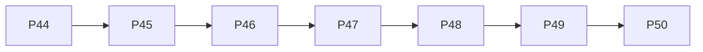

# Bazzite AI Phase Roadmap — P44–P50

## Overview
This document outlines the completion of phases P44 through P50 of the Bazzite AI Layer project. All phases in this range were completed on 2026-04-07.

## Phase Details

| Phase | Name | New Tools | New Timer | New LanceDB Table | Key Module |
|-------|------|-----------|-----------|-------------------|------------|
| **P44** | Input Validation | — | — | `tool_metadata` | `ai/mcp_bridge/tool_filter.py` |
| **P45** | Semantic Cache | — | — | `semantic_cache` | `ai/cache_semantic.py` |
| **P46** | Token Budget | `system.budget_status` | `dep-audit.timer` (Weekly) | `metrics` | `ai/budget.py` |
| **P47** | Code Patterns | `knowledge.pattern_search`, `knowledge.task_patterns` | — | `code_patterns`, `task_patterns` | `ai/rag/`, `ai/learning/` |
| **P48** | Headless Briefing | `security.alert_summary` | `security-alert.timer` (Every 6h) | `alerts` | `ai/security/alerts.py` |
| **P49** | Conversation Memory | `memory.search` | — | `conversation_memory` | `ai/memory.py` |
| **P50** | Integration Tests | — | — | `test_mappings` | `ai/testing/` |

> **Note**: Tool and timer additions reflect the incremental changes introduced in each phase. LanceDB tables store the persistent state for each feature.

## Dependency Graph

**Execution Order**: P44 → P45 → P46 → P47 → P48 → P49 → P50

## Completion Status
All phases P44–P50 are marked as **COMPLETE** with a completion date of **2026-04-07**.
